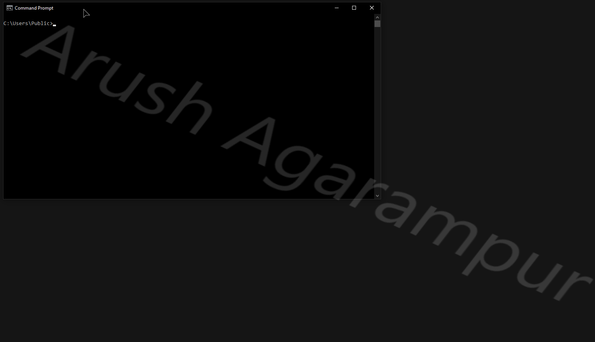

# ByeIntegrity Lite — Windows UAC Bypass
The sixth attack to bypass User Account Control (UAC) and gain elevated (Administrator) privileges to run any program at a high integrity level.

## Requirements
- Administrator account
- UAC notification level set to default or lower

## How it works
ByeIntegrity Lite uses a shell protocol handler hijack in order to bypass UAC. If you're unfamiliar with shell protocol handler hijacks, read the README on the ByeIntegrity 3.0 & 4.0 repos.

This attack is very simple. The first thing ByeIntegrity Lite does is hijack the default handler for the `ms-settings` protocol and sets it to open `cmd.exe`. Then, it simply runs `fodhelper.exe`, an autoelevated executable in the system directory.

By default, running `fodhelper.exe` will open the modern Settings app to the optional features page. `fodhelper.exe` launches the Settings app by simply using `ShellExecuteExW()` on the file `ms-settings:optionalfeatures`. Because ByeIntegrity Lite has hijacked this handler and set it equal to `cmd.exe`, `cmd.exe` will open, inheriting its elevated token from `fodhelper.exe`, instead of launching the Settings app. A very simple UAC bypass!

## UACMe
This attack is implemented in UACMe as method #67. The implementations used by ByeIntegrity Lite and UACMe are the same, except for two things: UACMe's custom `ProgId` is a random `GUID` value every time the attack is launched, and UACMe uses `UserAssocSet()` from `shell32.dll` across all Windows versions, even Windows 10. Otherwise, the implementations are exactly the same.

## Using the code
If you’re reading this then you probably know how to compile the source. Just note that this hasn’t been tested or designed with x86 in mind at all, and it probably won’t work on x86 anyways.

Just like UACMe, **I will never upload compiled binaries to this repo.** There are always people who want the world to crash and burn, and I'm not going to provide an easy route for them to run this on somebody else's computer and cause intentional damage. I also don't want script-kiddies to use this attack without understanding what it does and the damage it can cause.

## Supported versions
This attack should work on all versions of Windows 10.

